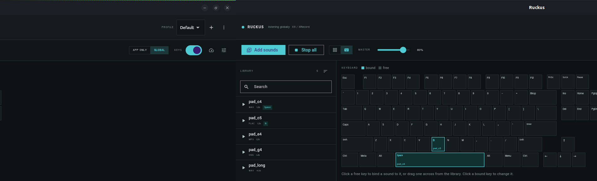

# Ruckus

A desktop soundboard for Ubuntu. Bind a sound to a key, press it anywhere — in a
game, a browser, a call — and it plays instantly.

```
Import sound  →  Assign key  →  Press key anywhere  →  Sound plays
```

Built with Flutter. Fully offline: no account, no telemetry, no network code at
all.



---

## Status

**v1.0.0 — feature complete for its scope.** Sounds import, keys bind, and
pressing them fires audio globally while the window is minimised or another
application has focus.

| | |
| --- | --- |
| Platform | Ubuntu, X11 session |
| Global keyboard | XRecord — no permissions, no setup |
| Audio | SoLoud, preloaded into memory, unlimited overlapping voices |
| Storage | SQLite, content-addressed audio files |
| Measured key→app latency | **0.36 ms** bridge + 5.80 ms device buffer |
| Tests | 23 automated checks, plus a 60 s sustained-load run |
| Packaging | `.deb` and AppImage, both self-contained |

Wayland and Windows are deliberately out of scope. See [Scope](#scope).

---

## Quick start

Requires Flutter 3.35+ and the usual Linux desktop toolchain
(`libgtk-3-dev ninja-build cmake clang pkg-config libx11-dev libxtst-dev`).

```bash
git clone https://github.com/Abhi-shekes/ruckus.git
cd ruckus/app
flutter pub get
flutter build linux --debug
./run.sh
```

Use `./run.sh` rather than the binary directly — it sets up two compatibility
shims that older Ubuntu needs, and tells you if the build is missing.

Verify the engine without touching the UI:

```bash
./run.sh --smoketest ../spike/assets/sounds
```

23 checks across the database, import, dedupe, preload, conflict handling,
profile round-tripping and every playback mode. Add `--stress` for a 60-second
sustained-load run that watches for voice leaks and memory growth.

Prefer a package?

```bash
./scripts/package.sh all      # → dist/*.deb and dist/*.AppImage
```

---

## Using it

1. **Add sounds** — MP3, WAV, OGG or FLAC. Drag files in from the desktop, or
   use Add sounds.
2. **Assign a key** — hover a sound and click the keyboard icon, then press the
   key you want. Or switch to the keyboard view, and click a free key or drag a
   sound onto it.
3. **Pick a mode.**
4. **Press the key** from any application.

Two views of the board: **pads** for what is bound, and the **keyboard map** for
the whole layout with bound keys picked out. Star a sound to float it to the top
of the library, and sort by name, recency, duration or format.

### Playback modes

| Mode | Behaviour |
| --- | --- |
| Play once | Every press starts another voice; presses overlap |
| Restart | Stops what this key was playing and starts over |
| Loop | First press loops it, second press stops |
| Toggle | First press plays, second press stops |
| Hold | Sounds only while the key is held down |

### Profiles

Each profile carries its own bindings. Switching swaps them instantly, so one
set for gaming and another for calls is a dropdown away. Profiles export to a
`.ruckus` file keyed by HID code and content hash — with the audio embedded for
a self-contained file, or without it to relink against the target library.

---

## Two things worth knowing

**Bound keys still type.** On Linux a global hook can observe keys but cannot
swallow them — grabbing the keyboard outright would stop you typing at all. Bind
`A` and pressing `A` still types an `A` wherever you are focused. The assign
dialog warns when you pick a bare letter or digit; **modifier combinations or
F-keys are what you want** for anything you press while typing. The `GLOBAL
KEYS` switch turns capture off without quitting, and the assign dialog names
the system shortcut you are about to shadow — Ctrl+C is reported as Copy.

**Your keystrokes go nowhere.** Ruckus reads every key on the machine, which
obliges it to: no keystroke is written to a log, file, database or crash report;
unmatched keys are discarded in native code before reaching Dart; bindings store
key *identities*, never a stream of input. There is no network code in the
project to send them anywhere even if it wanted to.

---

## How it works

```
                        Flutter UI  (Riverpod)
           soundboard · library · profiles · settings
                              │
                       DatabaseService  ──►  SQLite + sounds/
                              │
   ═════════════ HOT PATH — no UI, no rebuild ══════════════
                       BindingService
                    Map<int, KeyBinding>
                              ▼
                        AudioService  (SoLoud)
                preloaded sources → independent voices
                              ▼
                         system audio
   ═════════════════════════════════════════════════════════
                              ▲
                    KeyEvent (HID-normalised)
                              │
                       libruckus_keys.so
                    XRecord  ·  evdev (unused)
```

Four decisions carry most of the design:

**Audio is a game engine, not a media player.** SoLoud decodes each sound into
memory once at startup, so a keypress is a memory read with no decode on the
path. Every `play()` returns an independent voice, which is what lets twenty
rapid presses overlap instead of cutting each other off.

**Keys cross into Dart over FFI, not a platform channel.** Platform channels are
bound to the engine's platform thread and get awkward when the window is hidden —
the primary use case here. A `NativeCallable.listener` posts straight into the
isolate for about a third of a millisecond, independent of window state.

**Keys are identified by USB HID usage code.** Not scancodes, not characters.
The identity is stable and portable, and Flutter already ships the tables.

**The keypress path never touches Riverpod.** The active profile's bindings live
in a plain `Map`, rebuilt only when the profile changes. Riverpod drives the UI;
a keypress does a map lookup and calls the mixer.

**Audio files are content-addressed.** Imports are copied in and named by the
SHA-256 of their contents, so moving or deleting your originals cannot break a
binding, and importing the same file twice is recognised rather than duplicated.

---

## Layout

```
app/                    the application
├── lib/
│   ├── models.dart         Sound, Profile, KeyBinding, PlaybackMode
│   ├── state.dart          Riverpod — UI state only
│   ├── smoketest.dart      the automated harness
│   ├── services/           database · audio · keyboard · bindings · library
│   │                       · profile I/O · tray · desktop integration
│   └── features/           home · pads · keyboard map · library
│                           · assign · diagnostics & settings
└── linux/
    ├── native/             XRecord + evdev keyboard, StatusNotifier tray,
    │                       XKB layout labels (C) → libruckus_keys.so
    └── prebuilt/           compatibility shims for older Ubuntu

scripts/package.sh      builds the .deb and the AppImage
scripts/make-icon.py    generates the icon, no image library needed
spike/                  Phase 0 technical spike, kept for the record
docs/spike-results.md   what the spike proved, and what it changed
docs/troubleshooting.md symptoms, checks, fixes
PLAN.md                 architecture decisions and phases
TODO.md                 what is done and what is not
```

---

## Scope

Ubuntu on X11 only, by choice.

Dropping Wayland and Windows removed the project's largest risk rather than
mitigating it. Wayland has no protocol for global keyboard capture, so covering
it means reading `/dev/input/event*` directly, which needs the user in the
`input` group. XRecord needs nothing at all and works on every X11 session.

The evdev backend is written and sits behind the same interface
(`app/linux/native/sb_evdev.c`), so Wayland support is a switch to flip rather
than a rewrite — it simply has not been exercised. The Windows path
(`SetWindowsHookEx`) is designed in `PLAN.md` but not built.

---

## Known gaps

- **Wayland and Windows are not supported.** Deliberate; see Scope above.
- **The tray needs a StatusNotifier host.** Ruckus registers one directly over
  D-Bus rather than depending on libayatana-appindicator, so no extra package is
  required — but a desktop with no tray host at all shows no icon, and the close
  button quits instead of hiding. Settings reports which it found.
- **The keyboard map shows unmodified bindings only.** A flat keyboard cannot
  represent `Ctrl+Shift+A`; combinations are counted in the header and edited
  from the pad view.
- **Ubuntu 20.04 needs two shims**, both handled automatically by `run.sh` and
  baked into the packages. `flutter_soloud` ships a `libFLAC.so.14` built
  against glibc 2.34 while 20.04 has 2.31, so a rebuild at glibc 2.29 is checked
  into `app/linux/prebuilt/glibc231/`; and `sqflite_common_ffi` opens the
  unversioned `libsqlite3.so`, which only exists with `libsqlite3-dev`
  installed. Neither is needed on 22.04+.
- **No audio editing** — no trim, fade or normalise. Sounds play as imported.
- **No sound groups**, random-from-group, or MIDI input.

---

## If something is wrong

[docs/troubleshooting.md](docs/troubleshooting.md) covers the usual suspects:
keys not firing, silent playback, crackling audio, the glibc shims, a missing
tray icon, and how to tell whether the problem is Ruckus or the machine.

---

## Licence

MIT. See [LICENSE](LICENSE).
